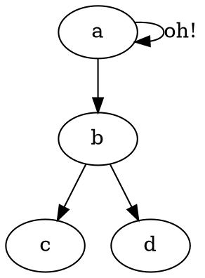
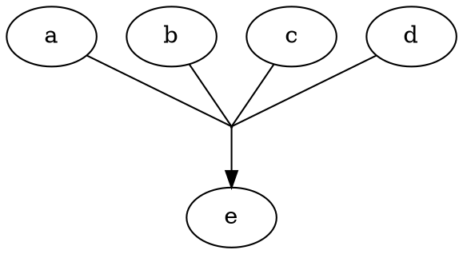

# Compile dot

To compile your `*.dot` file use the `dot` CLI tool as follows

```bash
dot -T[FORMAT] [INPUT] -o [OUTPU]

# Example
dot -Tpng graph.dot -o graph.png
```

# DPI / Resolution

There are two methods to tune the Dots Per Inch `DPI` in the output graph, the first one is to use the `-Gdpi=` flag and the second one is to use `graph [ dpi = 600 ];` in your `dot` file



# Aggregate arrow heads

> Source: https://mike42.me/blog/2015-02-how-to-merge-edges-in-graphviz

Just create a node that is invisibly small and point the headless edges to it, then point that to the main node with a head of any type.


